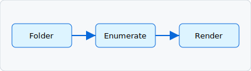

# Guide

This page is reached via an **internal link** from the [home page](index.md).

## Relative image

The diagram below is referenced with a relative path (`assets/diagram.svg`) and
is resolved against the picked folder as a `blob:` URL:

## Blockquote

> Internal links navigate within the viewer; external links open in a new tab;
> relative images load from the same folder.

Back to the [home page](index.md).
